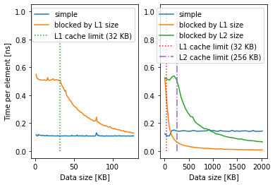

# Exercise 2

For the exercises, use numpy arrays for data unless instructed otherwise.

## Exercise 2.1: "Loop unrolling"

- Implement the example of loop-unrolling in section 1.7.2 (p. 52-54) in Python. Ignore the use of pointers and use a while loop instead of for loop. The reason is that Python for loops are automatically optimized in the background.
- You should try to unroll at least 2 and 4 steps. See my results for 16 steps below.
- Measure the execution time.
- For reference, my results, for N=1.000.000 are the following:
    ```
    Normal while loop:
    345 ms ± 16.7 ms per loop (mean ± std. dev. of 7 runs, 1 loop each)
    While loop w. 2-step unrolling:
    425 ms ± 3.36 ms per loop (mean ± std. dev. of 7 runs, 1 loop each)
    While loop w. 4-step unrolling:
    366 ms ± 3.74 ms per loop (mean ± std. dev. of 7 runs, 1 loop each)
    While loop w. 8-step unrolling:
    339 ms ± 3.7 ms per loop (mean ± std. dev. of 7 runs, 1 loop each)
    While loop w. 16-step unrolling:
    323 ms ± 2 ms per loop (mean ± std. dev. of 7 runs, 1 loop each)
    Numpy dot product:
    270 µs ± 6.12 µs per loop (mean ± std. dev. of 7 runs, 1000 loops each)
    ```

- I found that with Numba, the improvement is more significant. See instructions here: <https://numba.readthedocs.io/en/stable/user/5minguide.html>
    ```
    Normal while loop:
    944 µs ± 1.05 µs per loop (mean ± std. dev. of 7 runs, 1000 loops each)
    While loop w. 2-step unrolling:
    474 µs ± 836 ns per loop (mean ± std. dev. of 7 runs, 1000 loops each)
    While loop w. 4-step unrolling:
    265 µs ± 1.09 µs per loop (mean ± std. dev. of 7 runs, 1000 loops each)
    While loop w. 8-step unrolling:
    257 µs ± 832 ns per loop (mean ± std. dev. of 7 runs, 1000 loops each)
    While loop w. 16-step unrolling:
    259 µs ± 1.97 µs per loop (mean ± std. dev. of 7 runs, 1000 loops each)
    Numpy dot product:
    471 µs ± 1.42 µs per loop (mean ± std. dev. of 7 runs, 1000 loops each)
    ```
  - Interestingly, it seems that a manual loop-unrolling of 4 to 8 steps compiled with Numba can even outperform Numpy. This is obtained on Apple M1 Max CPU. Do you get similar results on your computer?

## Exercise 2.2: "Cache blocking"

- Implement the example in the 4th-6th line of section 1.7.3 (p. 55) in Python. Use while loop instead of for loop. Also, use [Numba](https://numba.readthedocs.io/en/stable/user/5minguide.html) to compile your Python function for highest performance. Interpreted Python is too slow to reveal the difference in cache latency.
- Increase the size parameter, measure the execution time and calculate the time per operation. At some point, when exceeding the L1 cache size (often 32 KB), the time per operation should increase.
- Extend the code to use the cache blocking principle and verify that the time per operation goes down.
My results look like this:

